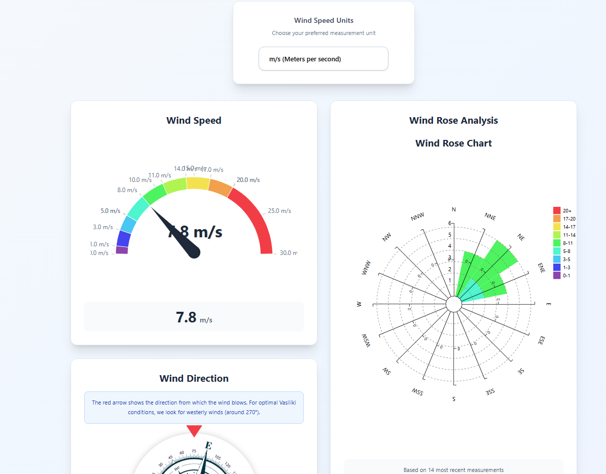

# Aiolos Monorepo

**Live wind tracking platform for water sports, powered by custom IoT meteostations.**

- 🌐 [aiolos.resonect.cz](https://aiolos.resonect.cz/)

---

## Overview

Aiolos is a modern, scalable platform for collecting, storing, and serving real-time wind and weather data from custom-built IoT stations. The system is designed for reliability, extensibility, and developer-friendliness.

### Key Features

- **Live wind & weather data** for water sports and research
- **Custom hardware**: [Aiolos meteostation](https://github.com/Resonect-Technology/Aiolos-HW)
- **Remote administration**: Station config management via Bruno API client
- **Modern backend**: AdonisJS REST API
- **OpenAPI/Swagger docs**: Auto-generated for the API
- **Monorepo**: Managed with [pnpm](https://pnpm.io/) and [Turborepo](https://turbo.build/)
- **Production infra as code**: [See infra/README.md for AWS/Terraform/Docker Compose setup](infra/README.md)

---



---

## Monorepo Structure

```
/
├── apps/
│   ├── adonis-api/      # RESTful backend API (AdonisJS v6)
│   ├── bruno-api/       # API client for managing station configuration
│   └── react-frontend/  # User interface for live data (React, Vite)
├── firmware/            # ESP32/SIM7000G code for weather stations
├── hardware/            # 3D models and hardware specs
├── package.json
├── pnpm-workspace.yaml
├── turbo.json
└── README.md (this file)
```

- Each app has its own README with setup, usage, and API details.

---

## Apps

### Adonis API Service ([docs](apps/adonis-api/README.md))

- Stores and exposes sensor data (wind, temperature)
- RESTful, IoT-friendly routes: `/station/:station_id/readings`
- Direct HTTP endpoint for weather stations to submit data
- Auto-generated OpenAPI docs with [adonis-autoswagger](https://github.com/ad-on-is/adonis-autoswagger)

### Bruno API Client ([docs](apps/bruno-api/README.md))

- API client collection for managing station configuration and viewing diagnostics
- Git-friendly alternative to Postman/Insomnia that stores collections as files
- Used for remote configuration and diagnostics of weather stations
- Includes environments for development and production
- Provides easy access to station configuration without requiring the frontend

### React Frontend ([docs](apps/react-frontend/README.md))

- User interface built with React, Vite, and TypeScript.
- Displays live wind speed (with unit conversion) and direction using dynamic gauges and a compass.
- Connects to the Adonis API via Server-Sent Events (SSE) for real-time data.
- Provides controls for interacting with mock data streams from the backend.

### Firmware ([docs](firmware/README.md))

- Embedded code for the Aiolos meteostation hardware
- Written for Arduino-compatible microcontrollers (ESP32 + SIM7000G)
- Handles sensor readings, power management, and HTTP communication
- Includes configuration and usage guides for hardware setup

---

## Quickstart

From the repo root:

```sh
pnpm install
```

See each app's README for how to run, configure, and test the services.

---

## Contributing & Extending

- Add new sensors or data types by extending the API routes/models
- Use JSDoc comments for OpenAPI docs
- See code comments and each app's README for details

---

## License

This project is licensed under the GNU Affero General Public License v3.0 (AGPL-3.0). See the [LICENSE](LICENSE) file for details.

[](https://www.gnu.org/licenses/agpl-3.0)

---

## AI-First Development with GitHub Copilot

This project uses **GitHub Copilot extensively** as an AI-first development approach. We've configured a comprehensive setup to maximize Copilot's effectiveness on complex IoT and web development tasks.

### Our Copilot Setup

- **Custom Instructions**: [`.github/copilot-instructions.md`](.github/copilot-instructions.md) provides project-specific guidance including architecture patterns, development workflows, and integration points
- **Environment Setup**: [`.github/workflows/copilot-setup-steps.yml`](.github/workflows/copilot-setup-steps.yml) pre-installs all dependencies (Node.js, Python, PlatformIO, databases) so Copilot can build, test, and validate changes in its development environment
- **Multi-Component Architecture**: Copilot understands the relationships between firmware (ESP32), backend (AdonisJS), and frontend (React) components

### Best Practices for Task Assignment

When assigning tasks to Copilot, follow these guidelines based on [GitHub's best practices](https://docs.github.com/en/enterprise-cloud@latest/copilot/how-tos/agents/copilot-coding-agent/best-practices-for-using-copilot-to-work-on-tasks):

**✅ Good Tasks for Copilot:**

- Bug fixes and user interface improvements
- Test coverage expansion and documentation updates
- API endpoint additions and database schema changes
- Frontend component development using our shadcn/ui + Tailwind stack
- Firmware sensor integration and power management optimizations

**❌ Tasks to Handle Yourself:**

- Complex cross-repository refactoring requiring deep domain knowledge
- Production-critical issues and security-sensitive changes
- Ambiguous tasks lacking clear requirements
- Major architectural decisions affecting multiple components

**📝 Writing Effective Issues:**

- Provide clear problem descriptions and complete acceptance criteria
- Specify which files/components need changes
- Include context about the IoT hardware constraints and API compatibility requirements
- Reference relevant documentation sections when applicable

### Pull Request Iteration

Use pull request comments to iterate with Copilot - it will read comments from users with write access and make required changes automatically. Batch multiple comments using "Start a review" for more efficient collaboration.

---
